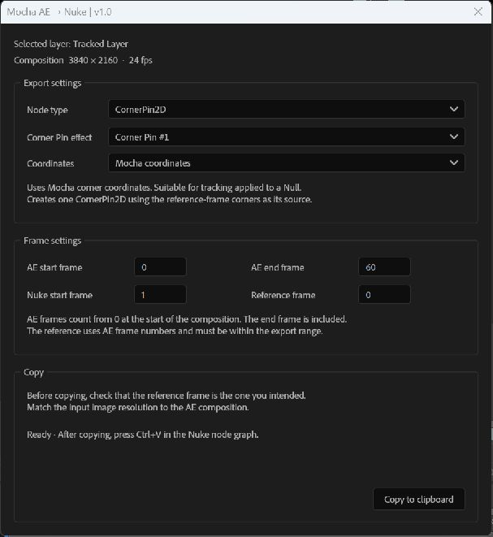
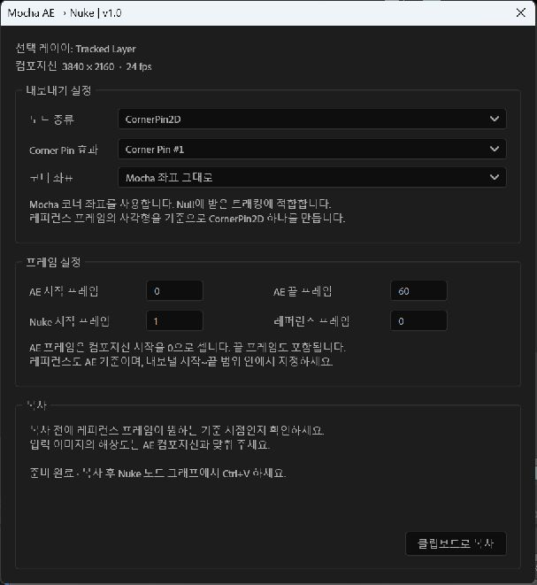

# Mocha AE → Nuke v1.0

Copy Mocha tracking applied in After Effects into Nuke as a single **CornerPin2D** or **Transform** node.

After Effects에 적용한 Mocha 트래킹을 **CornerPin2D** 또는 **Transform** 노드 하나로 복사합니다.

## English

1. Download this repository with **Code → Download ZIP** and extract it. Keep `MochaClipboard.exe` beside the JSX scripts. Windows only.
2. In AE, enable **Preferences → Scripting & Expressions → Allow Scripts to Write Files and Access Network**.
3. Track in Mocha AE, save, and return to AE. Use **Create Track Data**, select the tracked layer, then **Apply Export** with **Corner Pin** or **Transform**.
4. Select the layer receiving the keyframes. Run `Mocha_AE_to_Nuke_EN.jsx` through **File → Scripts → Run Script File…**.
5. Choose the node type, frame range and reference frame. Click **Copy to clipboard**, then press **Ctrl+V** in the Nuke node graph.

- **Nuke start frame:** defaults to **1**.
- **Reference frame:** defaults to **0**, using AE composition-relative frame numbers. Choose a frame inside the export range; the end frame is included. The node applies motion relative to this frame.
- **Mocha coordinates:** use this for corner data received on a Null. **Include layer transform** also applies the receiving layer's position, rotation and scale.
- Match the Nuke input resolution and pixel aspect ratio to the AE composition. Position the input for the reference frame before applying the exported node.
- Supports unparented 2D layers, standard Corner Pin and layer transforms. No CC Power Pin, motion-blur Corner Pin, 3D or roto export. Keys are sampled per frame with linear interpolation.

## 한국어

1. **Code → Download ZIP**으로 내려받아 압축을 풉니다. `MochaClipboard.exe`는 JSX와 같은 폴더에 두세요. Windows 전용입니다.
2. AE **환경 설정 → 스크립팅 및 표현식 → 스크립트를 통한 파일 쓰기 및 네트워크 액세스 허용**을 켭니다.
3. Mocha AE에서 트래킹을 저장하고 AE로 돌아옵니다. **Create Track Data**에서 추적한 레이어를 선택한 뒤, **Corner Pin** 또는 **Transform**으로 **Apply Export**합니다.
4. 키프레임을 받은 레이어를 선택하고 **파일 → 스크립트 → 스크립트 파일 실행…**에서 `Mocha_AE_to_Nuke_KO.jsx`를 실행합니다.
5. 노드 종류, 프레임 범위, 레퍼런스 프레임을 확인합니다. **클립보드로 복사** 후 Nuke 노드 그래프에서 **Ctrl+V**합니다.

- **Nuke 시작 프레임:** 기본값 **1**.
- **레퍼런스 프레임:** 기본값 **0**. AE 컴포지션 시작을 0으로 세며, 내보낼 시작~끝 범위 안에서 지정합니다. 끝 프레임도 포함됩니다. 지정한 프레임 대비 움직임을 적용합니다.
- **Mocha 좌표 그대로:** Null에 받은 코너 트래킹에 사용합니다. **레이어 변환 포함**은 해당 레이어의 위치·회전·크기를 추가로 적용합니다.
- Nuke 입력 해상도와 픽셀 종횡비를 AE 컴포지션에 맞추세요. 입력 이미지를 레퍼런스 프레임에 맞춰 배치한 뒤 생성된 노드를 적용합니다.
- 부모가 없는 2D 레이어, 표준 Corner Pin, 레이어 Transform을 지원합니다. CC Power Pin, 모션블러용 Corner Pin, 3D, 로토는 지원하지 않습니다. 매 프레임 샘플링하며 프레임 사이는 선형 보간합니다.

## Clipboard helper / 클립보드 도우미

`MochaClipboard.exe` copies and verifies the node text through the Windows clipboard. Its source is `MochaClipboard.cs`. No installer or network access. No `.nk` save step.

`MochaClipboard.exe`는 Windows 클립보드에 노드 텍스트를 복사하고 확인합니다. 소스는 `MochaClipboard.cs`입니다. 설치와 외부 통신 없이 동작하며 `.nk` 저장 단계는 없습니다.

UI screenshots use a temporary sample layer. Numerical tests passed; end-to-end Nuke rendering has not been verified.

화면 캡처는 임시 샘플 레이어를 사용했습니다. 수치 테스트를 통과했으며 실제 Nuke 렌더까지 검증한 상태는 아닙니다.
